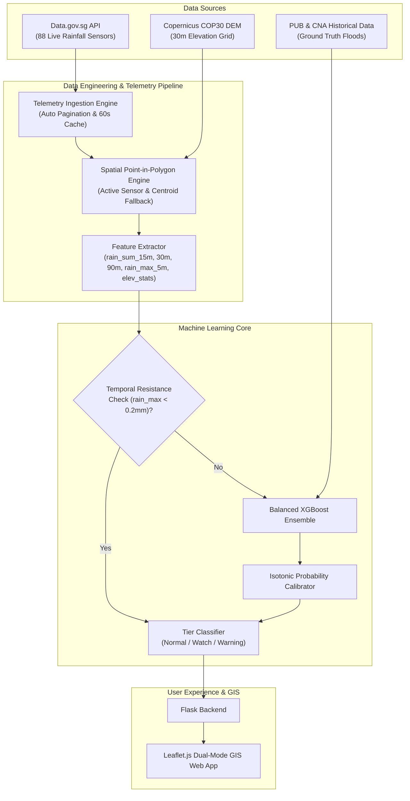

# 🌊 Singapore Flood Risk Intelligence & Real-Time Forecasting System

[](https://www.python.org/)
[](https://flask.palletsprojects.com/)
[](https://xgboost.readthedocs.io/)
[](https://geopandas.org/)
[](https://leafletjs.com/)


An end-to-end **Geospatial AI & Real-Time Hydrometeorological Telemetry System** that forecasts urban flash flood occurrences across all 55 Singapore Planning Areas with a **15-minute operational lead time**. 

Built with **Copernicus COP30 30m Digital Elevation Model (DEM)** data, live 5-minute automated telemetry ingestion from **Data.gov.sg (88 weather stations)**, and a **Calibrated XGBoost Machine Learning Ensemble**.

---

## 📌 Key Capabilities

- 🗺️ **Dual-Mode Interactive GIS Interface**:
  - **Flood Vulnerability Mode**: Topographic sensitivity analysis calculating mean elevation, local minimum, and elevation variance across all 55 planning zones.
  - **Real-Time 15-Min Forecast Mode**: Ingests rolling 1h 45m (21 intervals × 5 min) rainfall time series to predict imminent flood probabilities.
- 🤖 **Calibrated Machine Learning Engine**:
  - Balanced XGBoost Ensemble trained on verified PUB flood records, CNA news archives, and high-resolution precipitation time-series obtained through NEA Realtime Rainfall Reading API.
  - Custom **Focal Loss** objective function designed to address extreme class imbalance (~1:100 flood-to-dry ratio).
  - **Isotonic Regression Calibration** providing mathematically consistent posterior risk probabilities.
  - **Temporal Resistance Filter** (< 0.2mm peak threshold) eliminating spurious dry-weather false positives.
- ⚡ **Tiered Decision Framework & Incident Response**:
  - `NORMAL` (Calibrated Prob < 3%): Routine municipal monitoring.
  - `WATCH` (3% ≤ Prob < 12%): High-recall standby alerts for quick-response drainage maintenance crews.
  - `WARNING` (Prob ≥ 12%): High-precision emergency actions (mobile flood barrier deployment, traffic diversion, pump activation).
- 🛰️ **Resilient Live Telemetry Pipeline**:
  - Automated 60-second caching, cross-midnight query pagination, and dynamic nearest-sensor fallback guaranteeing 100% active sensor coverage.

---

## 🏗️ Architecture & Data Flow



---

## 📊 Machine Learning Model Specifications

| Attribute | Specification |
| :--- | :--- |
| **Model Type** | Balanced XGBoost Classifier Ensemble |
| **Objective Function** | Custom Focal Loss ($\gamma = 2.0, \alpha = 0.25$) |
| **Calibration** | Isotonic Regression Probability Calibrator |
| **Features** | `latitude`, `longitude`, `elev_mean`, `elev_min`, `elev_std`, `rain_sum_15m`, `rain_sum_30m`, `rain_sum_90m`, `rain_max_5m` |
| **Operational Thresholds** | Watch: $\ge 0.030$ (Recall: 90.0%), Warning: $\ge 0.120$ (Recall 70%) |
| **Lead Time** | 15 Minutes before inundation |

---

## 📁 Repository Structure

```text
├── final_project/
│   ├── app.py                             # Core Flask application & REST endpoints
│   ├── static/
│   │   ├── css/style.css                  # Custom responsive UI styling
│   │   └── js/map.js                      # Leaflet map controller & forecast renderer
│   ├── templates/
│   │   ├── index.html                     # Main interactive dashboard layout
│   │   └── layout.html                    # Base HTML Jinja2 template
│   ├── xgboost_training.py                # Model training, Focal Loss, & evaluation pipeline
│   ├── test_model.py                      # Offline & validation test suite
│   ├── rainfall_sensors.json              # 88 Enriched Singapore weather stations
│   ├── enriched_planning_areas.geojson    # 55 Planning areas with DEM elevation statistics
│   ├── xgboost_flood_ensemble.pkl         # Trained XGBoost model ensemble
│   ├── xgboost_flood_calibrator.pkl       # Trained Isotonic probability calibrator
│   ├── xgboost_flood_model_config.json    # Model metadata and threshold definitions
│   ├── fetch_rainfall_data.py             # Historical rainfall retrieval pipeline
│   ├── fetch_internetdata.py              # CNA news scraping & Gemini event extraction
│   ├── requirements.txt                   # Production Python dependencies
│   ├── Procfile                           # PaaS production start command
│   └── .env.example                       # Environment configuration template
├── SS/                                    # Superseded documents
├── requirements.txt                       # Root level Python dependencies
├── Procfile                               # Root level PaaS deployment configuration
├── .env.example                           # Root level environment template
├── .gitignore                             # Git ignore rules
└── README.md                              # Project documentation
```

---

## 🚀 Quick Start Guide

### 1. Prerequisites
- Python 3.10+ (tested on Python 3.12)
- Git

### 2. Clone the Repository
```bash
git clone https://github.com/RL1812/cs50_files.git
cd cs50_files/final_project
```

### 3. Install Dependencies
```bash
pip install -r requirements.txt
```

### 4. Configure Environment (Optional)
```bash
cp .env.example .env
# Edit .env to add DATA_GOV_SG_API_KEY if desired (default works without key)
```

### 5. Launch the Application
```bash
python app.py
```
Open your browser and navigate to `http://127.0.0.1:5000`.

---

## 🌐 Reference

### 1. Planning Area Boundaries & Elevation
- **Copernicus 30m DEM**: .tif file containing Elevation data derived from satellite measurement data.
- **National Map Polygon**: GeoJSON file provided by Data.gov.sg containing 55 planning areas and polygon coordinates.

### 2. Weather Station Metadata
- **Realtime/Historical Rainfall Readings**: API provided by Data.gov.sg containing rainfall readigns collected by all 88 active meteorological rainfall stations across Singapore.

### 3. Real-Time 15-Min Flood Forecast

```json
{
  "status": "success",
  "pln_area": "BUKIT TIMAH",
  "region_name": "Central Region",
  "sensor": {
    "id": "S213",
    "name": "Coronation Walk",
    "latitude": 1.32427,
    "longitude": 103.8097,
    "direct_match": true
  },
  "rainfall_window_minutes": 105,
  "readings_count": 21,
  "rainfall_metrics": {
    "rain_sum_15m": 0.0,
    "rain_sum_30m": 0.0,
    "rain_sum_90m": 0.0,
    "rain_max_5m": 0.0
  },
  "prediction": {
    "calibrated_prob_flood": 0.0,
    "prob_percentage": 0.0,
    "alert_tier": "NORMAL",
    "alert_label": "Normal (No Alert)",
    "alert_code": 0,
    "action_recommendation": "Routine weather and drainage monitoring."
  }
}
```

