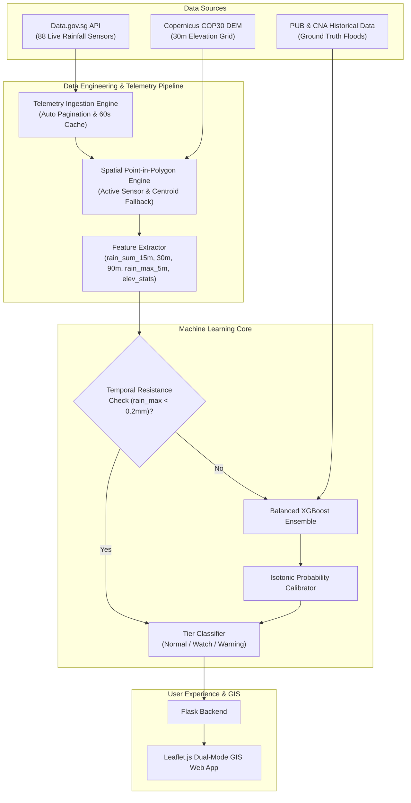

# 🌊 Singapore Flood Risk Intelligence & Real-Time Forecasting System

[](https://www.python.org/)
[](https://flask.palletsprojects.com/)
[](https://xgboost.readthedocs.io/)
[](https://geopandas.org/)
[](https://leafletjs.com/)


An end-to-end **Geospatial AI & Real-Time Hydrometeorological Telemetry System** that forecasts urban flash flood occurrences across all 55 Singapore Planning Areas with a **15-minute operational lead time**. 

Built with **Copernicus COP30 30m Digital Elevation Model (DEM)** data, live 5-minute automated telemetry ingestion from **Data.gov.sg (88 weather stations)**, and a **Calibrated XGBoost Machine Learning Ensemble**.

---

## 📌 Key Capabilities

- 🗺️ **Dual-Mode Interactive GIS Interface**:
  - **Flood Vulnerability Mode**: Topographic sensitivity analysis calculating mean elevation, local minimum, and elevation variance across all 55 planning zones.
  - **Real-Time 15-Min Forecast Mode**: Ingests rolling 1h 45m (21 intervals × 5 min) rainfall time series to predict imminent flood probabilities.
- 🤖 **Calibrated Machine Learning Engine**:
  - Balanced XGBoost Ensemble trained on verified PUB flood records, CNA news archives, and high-resolution precipitation time-series obtained through NEA Realtime Rainfall Reading API.
  - Custom **Focal Loss** objective function designed to address extreme class imbalance (~1:100 flood-to-dry ratio).
  - **Isotonic Regression Calibration** providing mathematically consistent posterior risk probabilities.
  - **Temporal Resistance Filter** (< 0.2mm peak threshold) eliminating spurious dry-weather false positives.
- ⚡ **Tiered Decision Framework & Incident Response**:
  - `NORMAL` (Calibrated Prob < 3%): Routine municipal monitoring.
  - `WATCH` (3% ≤ Prob < 12%): High-recall standby alerts for quick-response drainage maintenance crews.
  - `WARNING` (Prob ≥ 12%): High-precision emergency actions (mobile flood barrier deployment, traffic diversion, pump activation).
- 🛰️ **Resilient Live Telemetry Pipeline**:
  - Automated 60-second caching, cross-midnight query pagination, and dynamic nearest-sensor fallback guaranteeing 100% active sensor coverage.

---

## 🏗️ Architecture & Data Flow



---

## 📊 Machine Learning Model Specifications & Performance

| Attribute | Specification / Metric |
| :--- | :--- |
| **Model Type** | Balanced XGBoost Classifier Ensemble (8 sub-models) |
| **Objective Function** | Custom Focal Loss ($\gamma = 2.0, \alpha = 0.25$) |
| **Calibration Method** | Isotonic Regression Probability Calibrator |
| **Validation Scheme** | Stratified 5-Fold Cross-Validation across 5 random seeds |
| **ROC-AUC (Discrimination)** | **0.721 $\pm$ 0.015** (Aggregate: 0.725) |
| **PR-AUC (Precision-Recall)** | **0.153 $\pm$ 0.014** ($>2\times$ lift over 0.072 random baseline) |
| **Training Dataset** | 279 samples (20 verified flood events, 259 non-flood cases) |
| **Features (9)** | `latitude`, `longitude`, `elev_mean`, `elev_min`, `elev_std`, `rain_sum_15m`, `rain_sum_30m`, `rain_sum_90m`, `rain_max_5m` |
| **Lead Time** | 15 Minutes before inundation |

### Operational Alert Tiers & Decision Thresholds

| Alert Tier | Calibrated Threshold ($P$) | Recall (Catch Rate) | Precision (Alarm Accuracy) | False Alarm Reduction | Operational Action |
| :--- | :---: | :---: | :---: | :---: | :--- |
| **NORMAL** | $< 0.030$ *(or peak rain $< 0.2$mm)* | — | — | Baseline | Routine municipal monitoring. |
| **WATCH** | $\ge 0.030$ | **95.0%** (19/20) | **11.4%** | Safety net | High situational awareness; standby maintenance crews. |
| **OPTIMAL** | $\ge 0.080$ | **70.0%** (14/20) | **17.1%** | $F_2 = 0.432$ | Best operating balance prioritizing recall over precision. |
| **WARNING** | $\ge 0.120$ | **65.0%** (13/20) | **16.9%** | **56% fewer false alarms** | Immediate tactical response: deploy flood barriers & traffic diversions. |

---

## 📁 Project Structure

```text
final_project/
├── app.py                                 # Core Flask application & REST endpoints
├── static/
│   ├── css/style.css                      # Custom responsive UI styling
│   └── js/map.js                          # Leaflet map controller & forecast renderer
├── templates/
│   ├── index.html                         # Main interactive dashboard layout
│   └── layout.html                        # Base HTML Jinja2 template
│
├── helpers/                               # Offline data-collection, training & test scripts
│   ├── fetch_flood_alerts.py              #  1. PUB flood alerts (Data.gov.sg)
│   ├── fetch_flood_event_days.py          #  2. All records on flood-event days
│   ├── extract_flood_events.py            #  3. Flood alerts -> planning-area flood events
│   ├── fetch_internetdata.py              #  4. CNA news scraping & Gemini event extraction
│   ├── fetch_rainfall_data.py             #  5. Rainfall before each flood event + sensor metadata
│   ├── fetch_no_flood_rainfall_data.py    #  6. Rainfall at non-flooded sensors (negative samples)
│   ├── data_clean.py                      #  7. Drops "subsided" alerts from the rainfall records
│   ├── json_csv.py                        #  8. Rainfall records -> training_dataset.csv
│   ├── xgboost_training.py                #  9. Focal-loss XGBoost ensemble + calibration
│   ├── test_model.py                      # 10. Offline check of the trained model
│   ├── dem.py                             # DEM inspection & dem_visualization.png
│   ├── enrich.py                          # DEM -> enriched_planning_areas.geojson
│   └── geojson.py                         # Planning-area boundary preview map
│
├── xgboost_flood_ensemble.pkl             # Trained XGBoost model ensemble (used by app)
├── xgboost_flood_calibrator.pkl           # Trained Isotonic probability calibrator (used by app)
├── xgboost_flood_model_config.json        # Model metadata and thresholds (used by app)
├── xgboost_flood_model.{pkl,json}         # Single-model baseline
│
├── enriched_planning_areas.geojson        # 55 Planning areas with DEM elevation statistics (used by app)
├── rainfall_sensors.json                  # 88 Enriched Singapore weather stations (used by app)
├── flood_rainfall_records.json            # Rainfall windows before flood events (training input)
├── noflood_rainfall_records.json          # Rainfall windows with no flooding (training input)
├── training_dataset.csv                   # Model training data (+ _cleaned variant)
├── MasterPlan2019PlanningAreaBoundaryNoSea.geojson  # Raw planning-area boundaries
├── NationalMapPolygon.geojson             # National map outline
├── output_hh.tif / dem_visualization.png  # Copernicus 30m DEM & its visualisation
├── flood_event_days_summary.md            # Human-readable summary of flood-event days
│
├── requirements.txt                       # Web app dependencies
├── requirements-pipeline.txt              # Extra dependencies for the helpers/ scripts
├── Procfile                               # PaaS production start command
├── .env.example                           # Environment configuration template
└── README.md                              # Project documentation
```

Intermediate data that is not needed to run the app or retrain the model (the raw flood-alert cache,
flood-event extractions, CNA news events and sample API responses) is archived in `../SS/intermediate_data/`.

---

## 🚀 Quick Start Guide

### 1. Prerequisites
- Python 3.10+ (tested on Python 3.12 and 3.14)
- Git
- macOS only: OpenMP runtime for XGBoost — `brew install libomp`

### 2. Clone the Repository
```bash
git clone https://github.com/RL1812/Flood_Risk_Forecast.git
cd Flood_Risk_Forecast/final_project
```

### 3. Install Dependencies
```bash
python3 -m venv .venv
source .venv/bin/activate
pip install -r requirements.txt
# Optional, only to re-run the data collection / training scripts:
pip install -r requirements-pipeline.txt
```

### 4. Configure Environment (Optional / Recommended)
```bash
cp .env.example .env
# Edit .env to add:
# - CARTO_API_KEY: for CartoDB Positron basemap tiles (get free key at carto.com/basemaps/apikey)
# - DATA_GOV_SG_API_KEY: optional for higher rate limits (works without key on public tier)
```

### 5. Launch the Application
```bash
python app.py
```
Open your browser and navigate to `http://127.0.0.1:5000`.

> **macOS:** port 5000 is taken by AirPlay Receiver (requests return `403`). Run on another port with `PORT=5001 python app.py`, or set `PORT=5001` in `.env`.


### 6. Re-run the Data & Training Pipeline (Optional)
Requires `pip install -r requirements-pipeline.txt`. Scripts can be run from any directory; they read and
write data files in `final_project/`.
```bash
python helpers/json_csv.py           # rebuild training_dataset.csv from the rainfall records
python helpers/xgboost_training.py   # retrain ensemble + calibrator + config
python helpers/test_model.py         # sanity-check the trained model
```
Steps 1–6 in `helpers/` call live APIs (Data.gov.sg, Google News, Gemini) and regenerate the intermediate
JSON files in `final_project/`. To reuse the archived copies instead, pass them explicitly, e.g.
`python helpers/fetch_rainfall_data.py --flood-json ../SS/intermediate_data/flood_events_extracted.json --cna-json ../SS/intermediate_data/cna_flood_events_2023_2025.json`.

---

## 🌐 Reference

### 1. Planning Area Boundaries & Elevation
- **Copernicus 30m DEM**: .tif file containing Elevation data derived from satellite measurement data.
- **National Map Polygon**: GeoJSON file provided by Data.gov.sg containing 55 planning areas and polygon coordinates.

### 2. Weather Station Metadata
- **Realtime/Historical Rainfall Readings**: API provided by Data.gov.sg containing rainfall readigns collected by all 88 active meteorological rainfall stations across Singapore.

### 3. Real-Time 15-Min Flood Forecast

```json
{
  "status": "success",
  "pln_area": "BUKIT TIMAH",
  "region_name": "Central Region",
  "sensor": {
    "id": "S213",
    "name": "Coronation Walk",
    "latitude": 1.32427,
    "longitude": 103.8097,
    "direct_match": true
  },
  "rainfall_window_minutes": 105,
  "readings_count": 21,
  "rainfall_metrics": {
    "rain_sum_15m": 0.0,
    "rain_sum_30m": 0.0,
    "rain_sum_90m": 0.0,
    "rain_max_5m": 0.0
  },
  "prediction": {
    "calibrated_prob_flood": 0.0,
    "prob_percentage": 0.0,
    "alert_tier": "NORMAL",
    "alert_label": "Normal (No Alert)",
    "alert_code": 0,
    "action_recommendation": "Routine weather and drainage monitoring."
  }
}
```

